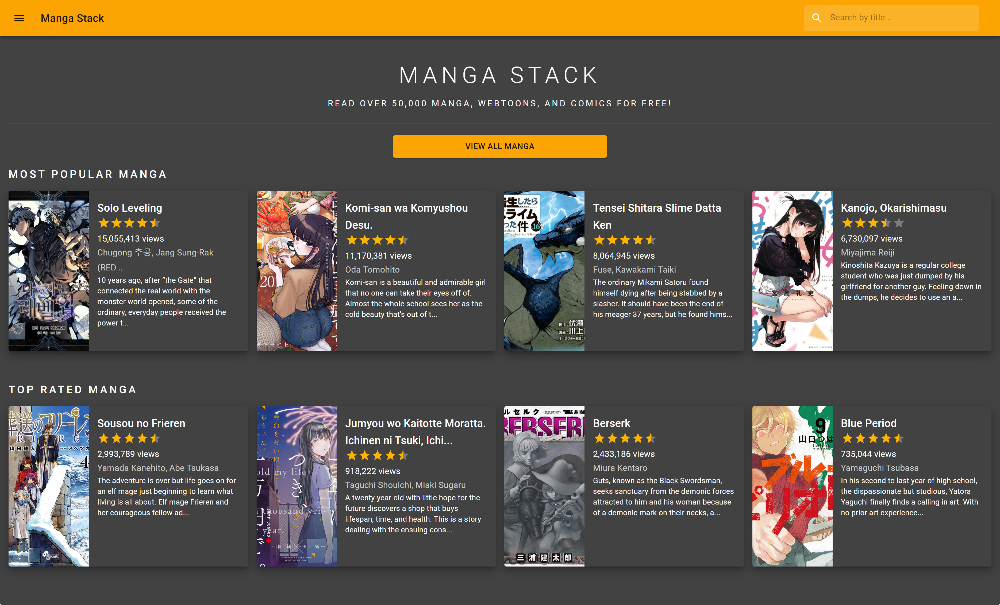
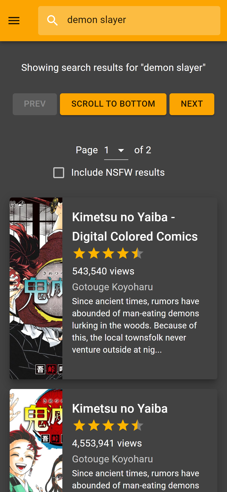
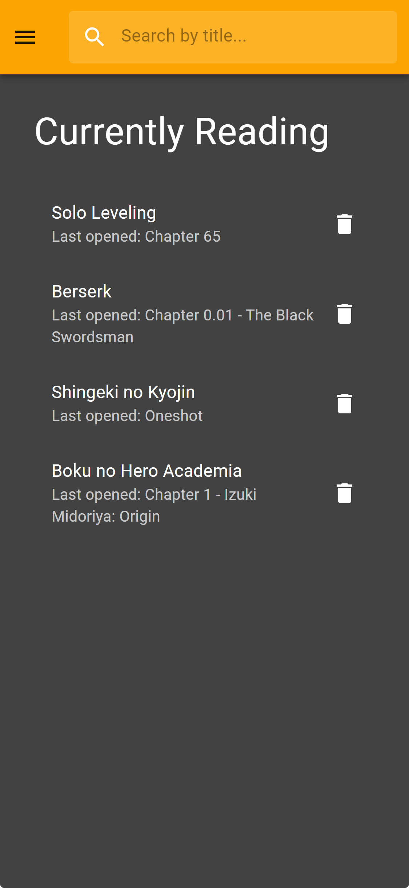
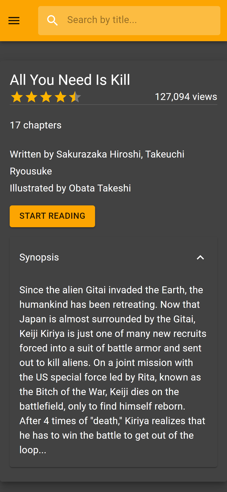
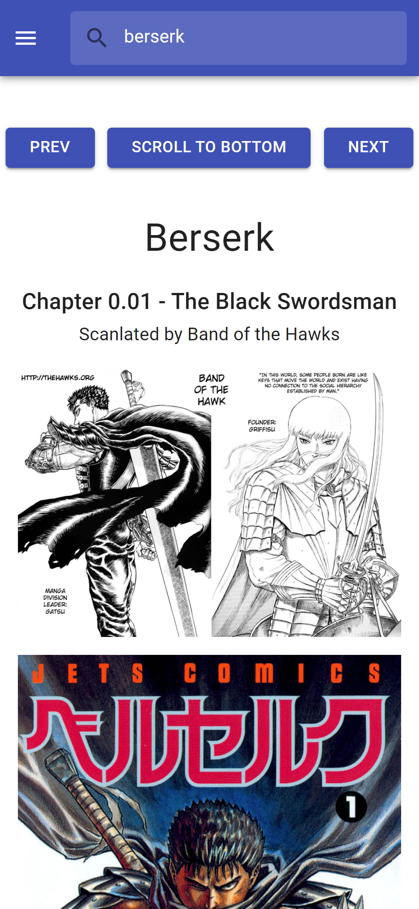
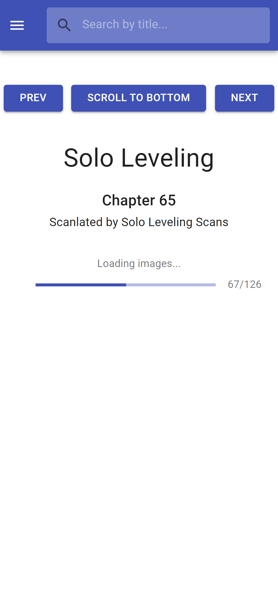
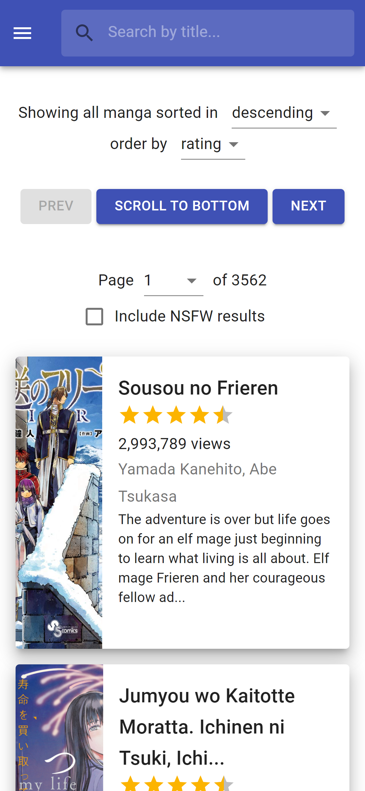

<p align="center">
  <a href="https://mangastack.cf/">
    
  </a>
</p>
<p align="center"><b>https://mangastack.cf/</b></p>

## About
MangaStack is a free, web-based manga reader for [MangaDex](https://mangadex.org/).

It uses MangaDex's [API version 2](https://mangadex.org/thread/351011) 

Currently, the backend is hosted on Heroku free tier, which can sometimes lead to slow cold starts.

<br>

## Features
- Mobile friendly
- Dark theme (Halloween)
- Automatic bookmarks/tracking of reading progress
- Fast search through MangaDex's catalog
- No authentication required
- Multiple language support
<br>

## Screenshots
<p align="center">
  
  
  
</p>
<p align="center">
  
  
  
</p>

<br>

## MangaDex Search API
Uses the https://mangadb-search.herokuapp.com/mangadb/search API endpoint to allow for fast search of all of MangaDex's titles, without the need for authentication. More details on this will be coming later, but for now, here's an example:

```
https://mangastack.cf/mangadb/search?q=one+piece&nsfw=false&limit=12&skip=0
```
